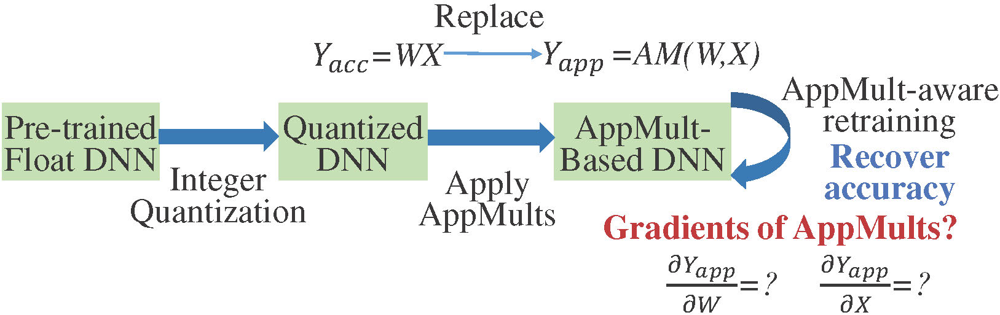

# Approximate Multiplier-Aware Retraining
Gradient Approximation of Approximate Multipliers for High-Accuracy Deep Neural Network Retraining

This project implements a framework to recover the accuracy of approximate multiplier (AppMult)-based deep neural networks (DNNs).
It simulates the AppMult function using lookup tables (LUTs) and features with arbitrary self-defined LUT-based gradients for the AppMult.
Its overall flow is shown below:


For more details, you can refer to the following paper:
[Chang Meng, Wayne Burleson, Weikang Qian, and Giovanni De Micheli, "*Gradient Approximation of Approximate Multipliers for High-Accuracy Deep Neural Network Retraining*," in Design Automation and Test in Europe (DATE) Conference, Lyon, France, 2025.](./paper/DATE_2025_Approximate_Multiplier_Aware_DNN_Training.pdf)


## Dependencies 

- Reference OS, **Ubuntu 20.04 LTS** 

- Reference AI development environment
    - Python 3.12.3
    - PyTorch 2.3.0+cu121
    - CUDA 12.4
    - CuDNN 8.9.2

- Reference C++ development environment (optional, used for circuit simulation & LUT generation)

  - Tools: gcc 10.3.0 & g++ 10.3.0 & [cmake](https://cmake.org/) 3.16.3

    You can install these tools with the following command:

    ```shell
    sudo apt install gcc-10
    sudo apt install g++-10
    sudo apt install cmake
    ```

    You also need to check whether the default versions of gcc and g++ are 10.3.0:

    ```shell
    gcc --version
    g++ --version
    ```

    If the default versions of gcc and g++ are not 10.3.0, please change them to 10.3.0.

  - Libraries: [libboost](https://www.boost.org/) 1.74.0, libreadline 8.0-4, libgmp, libmpfr, libmpc

    You can install these libraries with the following command:

    ```shell
    sudo apt install libboost1.74-all-dev
    sudo apt install libreadline-dev
    sudo apt install libgmp-dev
    sudo apt-get install libmpfr-dev
    sudo apt-get install libmpc-dev
    ```

## Download

- This project contains a submodule for circuit simulation and LUT generation: open-source logic synthesis and verification tool ABC

```shell
git clone --recursive https://github.com/changmg/AppMult-Aware-Retraining.git
```

Please ensure that you have added the argument "--recursive" to clone the submodule ABC.

- Pretrained models: You can find the pretrained FP32 models used in our experiments here:
[Pretrained models](https://github.com/changmg/AppMult-Aware-Retraining/releases/tag/v1.0.0)

## Project Structure

Key folders:

- app_mult: AppMult files, where the *.sop* file stores the AppMult's multi-level circuit, and the *<circuit_name>_lutfp+bp_avg_<half_window_size>_<half_window_size>.txt* stores the LUTs for the corresponding AppMult (including forward propagation AppMult values + backward propagation gradients; please refer to example 2 to know how to generate this file).
- mirconet+: Pytorch implementation of AppMult-aware retraining
- self_ops: CUDA-based self-defined GEMM operators for LUT-based forward and backward propagation of AppMults
- simulator: circuit simulator, used to generate lookup tables for AppMults

## Build

- To build the GEMM operators for LUT-based forward and backward propagation of AppMults, go to the project root directory, and then execute:

```shell
pip install -e .
```

If you compile successfully, you will obtain the following shared library in the project root directory:
*approx_ops.cpython-312-x86_64-linux-gnu.so*


- (Optional) To build the circuit simulator for generating the LUT for an AppMult (in the folder *simulator*), go to the project root directory, and then execute:

```shell
mkdir build
cd build
cmake -DCMAKE_BUILD_TYPE=Release ..
make
cd ..
```

If you compile successfully, you will obtain the following executable program:
*simulator.out*

## Run

### Example 1 

- To perform AppMult-aware retraining for DNNs using difference-based gradient approximation for the AppMult, a reference command is:

```shell
python micronet+/app_train.py -f -b 7 -l ./app_mults/resub_als/Mult_7_7_MED_63.6771_size_178_depth_23_lutfp+bp_avg_8_8.txt -p ./pretrained/cifar10_resnet18_fp32_acc_94.06.pth
```
where *-f* option means using a fixed random seed for the purpose of reproducing the experimental results,

*-b* option specifies the bit-width of the applied AppMult,

*-l* option specifies the path to the AppMult LUT (including forward propagation AppMult values + backward propagation gradients; please refer to example 2 for the generation details),

and *-p* option specifies the path to the pretrained FP32 DNN model.

After 30 epochs, the accuracy will recover from about 10% to about 90%.

- To perform AppMult-aware retraining for DNNs using straight-through estimation (STE) gradient for the AppMult, a reference command is:

```shell
python micronet+/app_train.py -u -f -b 7 -l ./app_mults/resub_als/Mult_7_7_MED_63.6771_size_178_depth_23_lutfp+bp_avg_8_8.txt -p ./pretrained/cifar10_resnet18_fp32_acc_94.06.pth
```
where *-u* option means using the STE estimator.

After 30 epochs, the accuracy will recover from about 10% to about 80%.

### Example 2
To generate the AppMult LUT (including forward propagation AppMult values + backward propagation gradients),
a reference flow is as follows:

```shell
./simulator.out --appMult ./app_mults/resub_als/Mult_7_7_MED_45.8873_size_189_depth_25_sop.blif > ./tmp/Mult_7_7_MED_45.8873_size_189_depth_25_lutfp.txt

python scripts/gen_bp_lut.py -f ./tmp/Mult_7_7_MED_45.8873_size_189_depth_25_lutfp.txt -w 8 > ./tmp/Mult_7_7_MED_45.8873_size_189_depth_25_lutfp+bp_avg_8_8.txt
```

The first command calls *simulator.out* to simulate the AppMult *./app_mults/resub_als/Mult_7_7_MED_45.8873_size_189_depth_25_sop.blif* and generates a LUT that stores the AppMult values for each input combination, i.e., *./tmp/Mult_7_7_MED_45.8873_size_189_depth_25_lutfp.txt*

The second command computes difference-based gradient approximation using a half window size of *w=8* (please refer to our paper). It generates a new file, *./tmp/Mult_7_7_MED_45.8873_size_189_depth_25_lutfp+bp_avg_8_8.txt*, including a LUT for forward propagation and two LUTs storing the gradients of the AppMult with regards to two input operands.

## Misc
- The default version is fixed for 7-bit AppMults. To test AppMults with different bit-widths (no more than 8-bit), please change the MACRO of "QUANTIZATION_BIT" to the required value in the CUDA code here:

https://github.com/changmg/AppMult-Aware-Retraining/blob/master/self_ops/src/approx_mult.h#L12

For example, if you want to test 8-bit AppMults, modify the CUDA code to "#define QUANTIZATION_BIT 8" and re-compile.
Meanwhile, you also need to specify the *-b* option in the *app_train.py* to 8 (if you are testing 8-bit AppMults).
